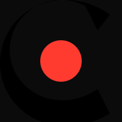
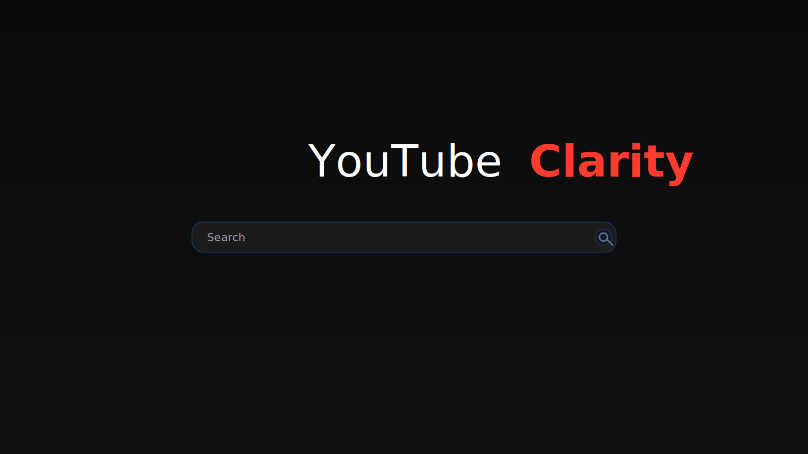

  
  

  <strong>YouTube Clarity</strong> 
  A clean, minimal YouTube homepage focused on search — not distractions.

---

## What is it?

YouTube Clarity replaces the busy YouTube homepage with a focused, distraction‑free search screen. Type what you want, press Enter, and get on with your day — without falling into recommendations.

> ⚠️ Independent project. Not affiliated with, endorsed by, or officially connected to YouTube or Google.

## What it does

- **Clean dark background**: No visual clutter — just pure focus
- **Centered search bar**: Find exactly what you need instantly
- **Real YouTube suggestions**: Autocomplete as you type
- **Keyboard navigation**: Arrow keys + Enter for fast searches
- **Seamless experience**: Only the homepage changes; watch pages work normally

## How it works

1. Install the extension
2. Go to `youtube.com`
3. See the clean search interface instead of the recommendation feed
4. Search intentionally and stay on track
5. All other pages (videos, channels, search results) behave normally

## Perfect for

- **Students** who want to reach lectures without the noise
- **Professionals** avoiding work‑time distractions
- **Anyone** who wants to be intentional with YouTube time
- **People** tired of losing hours to recommended videos

## Privacy & security

- **No data collection** — ever
- **No tracking or analytics**
- **100% local** — runs in your browser
- **Open‑source mindset** — simple and transparent

## Key features

- Zero‑distraction YouTube homepage
- Lightning‑fast search with autocomplete
- Beautiful, minimal design
- No configuration — it just works
- Completely free; no ads, no tracking

## Screenshots

Add your images to `assets/` and they will render here.

  

You can also include additional views:

- `assets/hero-searching.svg` (search with suggestions)
- `assets/side-by-side.svg` (comparison with default homepage)

## Privacy Policy

See `privacy_policy.md` for details.

## Contributing / Development

This repository doubles as the public landing page. To update visuals:

1. Create an `assets/` folder at the repo root (if it doesn't exist).
2. Add images named like `logo.svg` (provided), `hero.svg` (provided), `hero-searching.svg` (provided), `side-by-side.svg` (provided) or swap with your own PNG/JPGs and update the paths above.
3. Commit and push — the README will display them automatically.

## Install

Chrome Web Store listing link will appear here when published.

---

Start taking control of your YouTube experience today. Install YouTube Clarity and say goodbye to endless scrolling.

